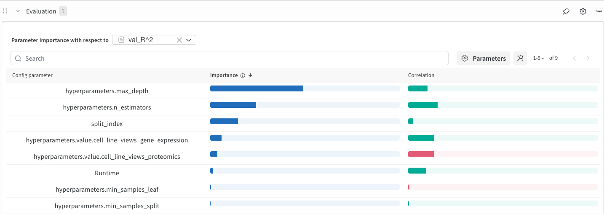
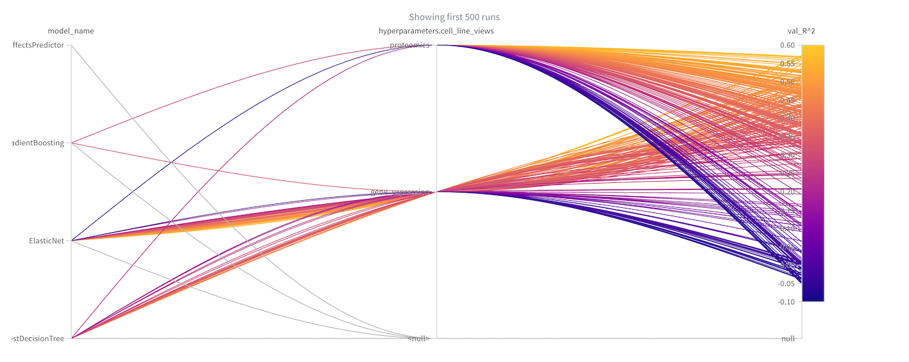
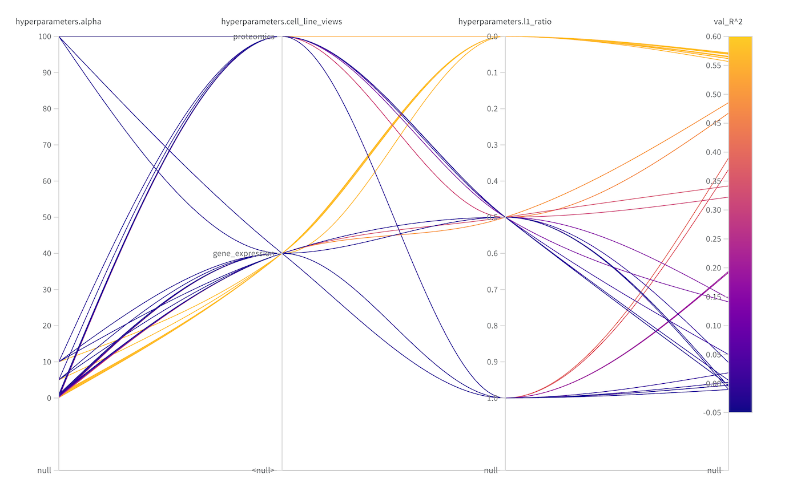

DrEvalPy and Weights & Biases
======================================

We have a weights and biases integration for all our models. You can use this functionality very easily
by just supplying an extra parameter ``--wandb_project``:

.. code-block:: bash

    drevalpy -- run_id my_wandb_run --models model1 model2 --baselines baseline1 baseline2 --dataset CTRPv2 --wandb_project my_new_project_name

You will be asked to generate an API key in the console. After inputting it, your project is connected to your
wandb account and you can look at your models online.

Example: Compare Flexible Inputs for DrEvalPy's Baselines
-------------------------------------------------------------

Through the :ref:`flexible-inputs`, we now treat omic input as hyperparameter for our sklearn baselines.
With wandb, we can compare model performances:

.. code-block:: yaml

    [All sklearn models]:
      cell_line_views:
        - gene_expression
        - proteomics
      drug_views:
        - fingerprints
      ..

.. code-block:: bash

    drevalpy --run_id compare_baselines \
             --models RandomForest \
             --baselines ElasticNet NaiveMeanEffectsPredictor GradientBoosting AdaBoostDecisionTree \
             --dataset TOYv1 \
             --wandb_project compare_baselines

With ``+ Add Panels``, you can add interesting visualization. Add ``Parameter Importance`` (with respect to
val_R^2) and select your hyperparameters of interest to be visible:

Add a ``Parallel Coordinates Plot``, too:

By filtering, you can investigate in a more detailed manner: Here, we filter to ``split_index=4`` and
``model_name="Elastic Net"`` and extend the parallel coordinates plot.

